# Keithley 2450 Arbitrary Current Waveform Player

This is a current waveform player for the Keithley 2450 Source Measure Unit (SMU). The features are:

* A nice GUI with all necessary settings, logging and plotting of the results

* Sources current and measures voltage

* The waveform is loaded from a LT-Spice style PWL text file, so you can compare your measurements with your simulation

* Timing is accurately done by the SMU internally

* Generates the trigger model and trigger timer. Loads the data points as config list into the SMU.

* Undervoltage lockout (UVLO) optionally included in the trigger model

* Ability to calculate NPLC (number of power line cycles) automatically based on the desired time step

* All settings can be saved and loaded with .ini files

* Export results to .csv 

* Extensive logging and failure detection

* Nice beep sounds (optional)

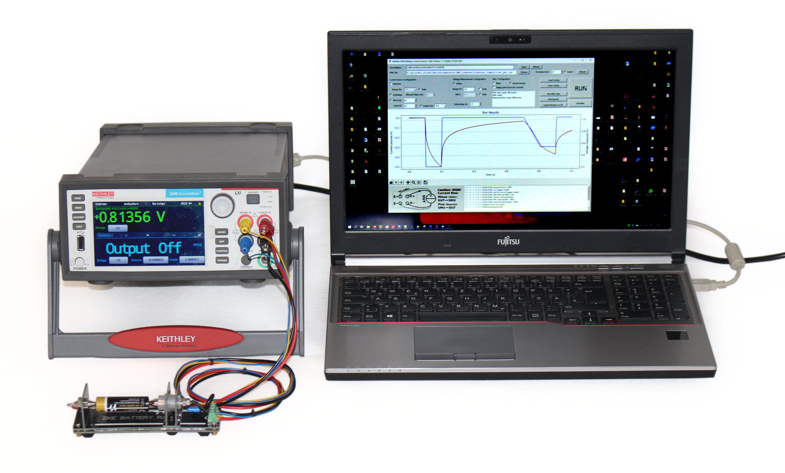

The example above generates pulsed load currents on an alkaline battery to compare with simulation results of a corresponding model. 

The 4-wire fixture shown can be bought [here](https://www.aliexpress.com/item/4000606429744.html).

## How to "Install"

### Windows

Just get the latest windows binaries from [Here](https://github.com/dotmjsc/K2450_Arb_I/releases). Additionally, you need a working VISA installation. I recommend Keysight VISA.

The binaries are made with PyInstaller. 

### Linux

It works on Linux, but you have to download the sources and install the necessary packages:

```shell
sudo pip install matplotlib
sudo pip install numpy
sudo pip install si-prefix
sudo pip install pyvisa
```

For Pyvisa to work properly then:

```shell
sudo pip install pyvisa-py
sudo apt-get -y install python3-usb
sudo apt-get -y install python-usb
```

If Pyvisa seems to work, but you can't find the USB device in the device list then try this and **reboot**:

```shell
# see https://stackoverflow.com/questions/66480203/pyvisa-not-listing-usb-instrument-on-linux
sudo su
echo 'SUBSYSTEM=="usb", MODE="0666", GROUP="usbusers"' >> /etc/udev/rules.d/99-com.rules
```

On Linux, the GUI will look ugly though.

## SMU Settings

You can connect to your SMU via USB, GPIB or LAN. You should however make sure that the Command Set is "TSP".  

Menu -> System -> Settings:

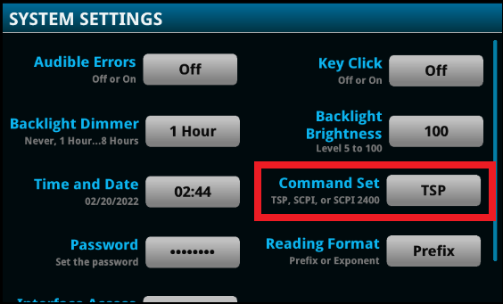

## Using the Software

After startup, you'll be greeted with a nice graphical user interface (Here shown in usage):

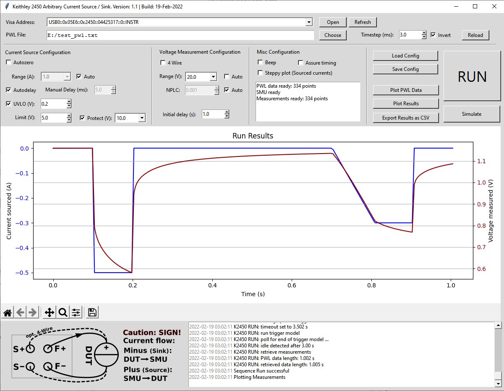

### Visa Instrument Selection


On startup the program automatically scans for available visa devices into the select box.

* **Open** tries to open the selected instrument. It will check if the instrument is indeed a Keithley 2450. If not you'll get a warning message.

* **Refresh** re-scans available Visa devices

### File Selection


* **Choose** opens a file dialog where you can choose your LT-Spice "piecewise linear" (PWL) file. 

* **Timestep** since the PWL file is a list of neuralgic data points, the program needs to interpolate to make a evenly spaced list of sample points for the current source. You'll basically control the sample rate with this.

* **Invert** you can invert the signs of all currents in the PWL file by setting this. Be aware that the K2450 will only act as load (when connected as in the picture at the bottom) when the currents have a negative sign!

* **Reload** reloads the file in case you changed the contents or the timestep. Important: if you don't Reload after you change the Timestep setting, the runtime will be stretched or shortened. This is a deliberate behavior.

After the PWL file is chosen or reloaded, the plot window shows the PWL waveform and the discrete steps (in red) based on the Timestep setting. Here shown with a rather long Timestep of 30ms:

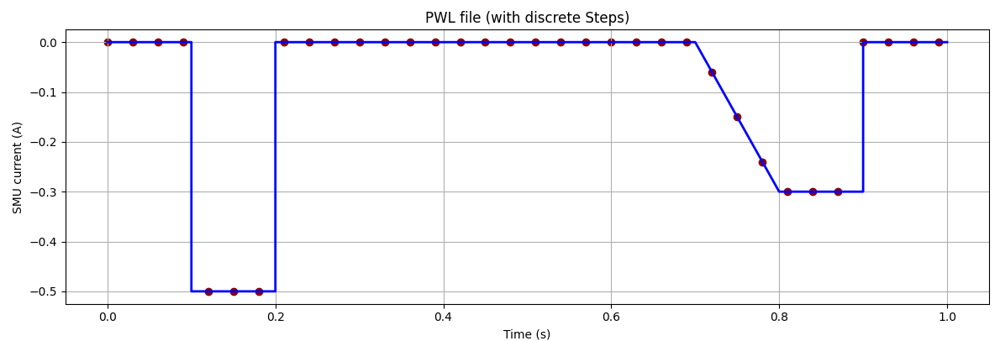

**Data Length:** The maximum allowed number of load data points to be loaded into the SMU is 299995 (limitation of the device). You can control the number of points in the info window. If the number of points exceed this, the data will be truncated and a warning is displayed:

    K2450: too many data points. Cropped to 299995!

### Source Settings

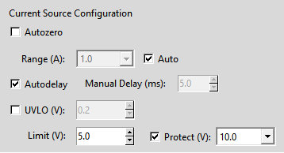

* **Autozero** helps to avoid drifts in long runs. As a penalty the measuring time will get longer. For fast runs with small time steps, disable autozero. The program will manually zero once before the run.

* **Range** sets the current range. Be aware that the different ranges got different Autodelay values (see below). If you choose **Auto**, the best range will be calculated from PWL data. If you got small currents but you don't want the high Autodelays, you can either manually set a higher range or a manual delay.

* **Autodelay** the SMU will choose a delay according to the list below

* **Manual Delay** if you are unhappy with the Autodelay values, you can set a manual delay here

* **UVLO** (Under Voltage Lock Out) if you enable this, the trigger model will be expanded to include a mechanism so that the SMU immediately switches off if the measured voltage drops lower than the UVLO value. This is in particular helpful if you connect a *battery pack* with a protection circuit. In a overcurrent condition, the protection circuit would cut the cells off. In consequence the output voltage of the SMU will go negative (up to the limit setting) and probably destroy something.

* **Limit** the voltage limit setting of the SMU

* **Protect** the protect setting of the SMU. Can be disabled.

The **Autodelay values** (as found in the Reference Manual) are:

| **Current range** | **Current source autodelay (ms)** |
|:-----------------:|:---------------------------------:|
| 10 nA             | 50                                |
| 100 nA            | 50                                |
| 1 µA              | 3                                 |
| 10 µA             | 2                                 |
| 100 µA            | 1                                 |
| 1 mA              | 1                                 |
| 10 mA             | 1                                 |
| 100 mA            | 1                                 |
| 1 A               | 2                                 |

### Measurement Settings

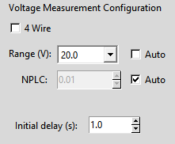

* **4 Wire** enables 4-Wire measurement. When the cable resistance matters, enable this setting. See the image on the bottom of the program how to connect.

* **Range** set the measurement range according to your DUT (device under test). You can use **Auto** for autoranging, but this is very slow, be warned!

* **NPLC** (Number of Power Line Cycles) this is essentially a averaging setting. The higher the less noise you will see on the measurements. One powerline cycle is 1/(line frequency). In European countries it is 20ms. The lowest setting is 0.01 - 200µs. If you choose **Auto** the program will determine the highest possible NPLC setting in respect to the total calculated source delay and the time step. I recommend this!

* **Initial Delay** is the time the SMU actively sources 0 (Zero) Amperes after it went from HIGH-Z to ON. Running the sequence starts afterwards. This is helpful to avoid measuring the tiny current spike that happens then. If your DUT is a electrochemical cell with a high ESR, better use a high setting here.

### Miscellaneous settings and Buttons

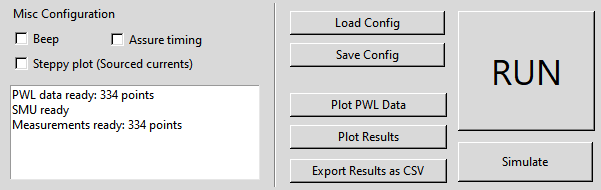

* **Beep** makes beeps on the SMU for start/end/error indication. Try this, it is really nice :)

* **Assure Timing** If the desired timestep is smaller than the calculated timestep, the run is aborted. Why do I need this? Let's assume you want to have a rather short timestep, for instance 2ms with a PWL file of 1s runtime, and you accidentally set NPLC to 10. Without "Assure Timing" it would run 100 seconds (you'll get a warning though). With "Assure Timing" you rather get an error and the sequence will not run:

  

* **Steppy Plot** by setting this, the current results will be plotted without interpolation. This helps finding problematic timestep settings where a smooth waveform can't be sourced. See this example:
  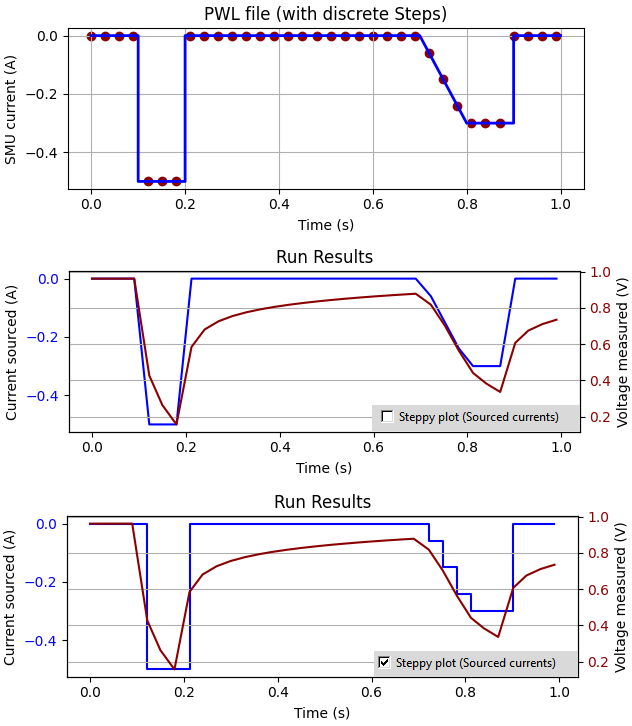

* **Load Config** opens a file dialog where you can load a config file. Its a standard .ini file that you can write yourself. Look at default.ini for the key names. Fallback is the  actual config, so a subset is also permitted.

* **Save Config** lets you save the complete settings to a file

* **Plot PWL data** plots the PWL file data

* **Plot Results** plots the measurements if valid data exists

* **Export Results as CSV** to export measurements as CSV

* **RUN** run the sequence if a valid PWL file is loaded and the SMU is ready

* **Simulate** loads the trigger model and the data points into the SMU, but does not run it. You can use this to check for errors,  for example by checking *Assure timing* and watching the log text. You should also take a look at the display of the SMU for further errors.

## Use without GUI

If you want to use the arbitrary current source in your own Python program, you need these three files:

* K2450_ArbCurrentSource.py

* K2450_Config.py

* PWL_Parser.py *(optional - only if you want to load PWL files)*

Then install the needed additional packages

```shell
pip install numpy
pip install si-prefix
pip install pyvisa
```

A simple example:

```python
import logging
logging.info = print  # temporarily redirect logging into Terminal

from K2450_ArbCurrentSource import K2450_ArbCurrentSource
K2450_SL = K2450_ArbCurrentSource("USB0::0x05E6::0x2450::04425317::0::INSTR")

K2450_SL.config.four_wire = True  # you can set the individual config elements manually
K2450_SL.config.load_file('default.ini')  # or you can load a configuration file

from PWL_Parser import PWL_parser
# load a pwl data file
pwl_data = PWL_parser('test_pwl.txt', K2450_SL.config.time_step)

# quick invert for load points (if needed)
def Invert(lst):
	return [-i for i in lst]

K2450_SL.load_data_points(Invert(pwl_data.values_discrete))  # load inverted data

status = K2450_SL.run_sequence(simulate=False)
if status is False:
	print('Error occurred')
else:
	print('Run finished with %d warnings' % status)

results = K2450_SL.return_results()
print(results['timestamps'])
print(results['currents'])
print(results['voltages'])

del K2450_SL
```

## How it works

### SMU Timer and Trigger Model

For n data points the program will make a source configuration list called "SOURCE LIST"  with n+2 points. The first point will hold the general settings and the source level is set to 0A. The last element is set to 0A as well.

A measure configuration list named "MEAS_LIST" hold only a single item with the measurement settings.

A trigger timer is set up that starts with a notification stimulus from a trigger block. The Delay is set to the Timestep value (here: 2.5 ms). 

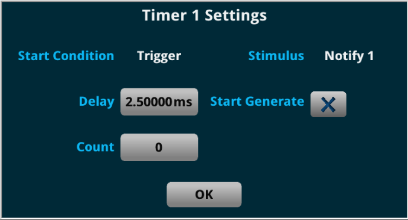

For normal operation a trigger model is created like below:

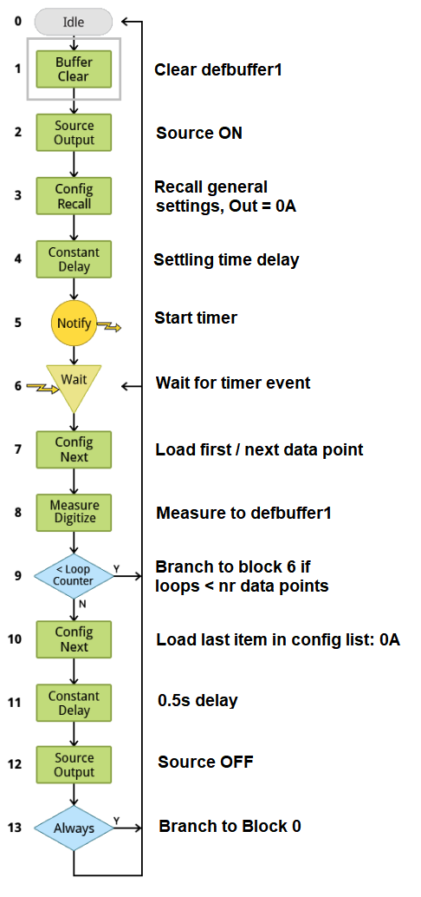

At first the source is turned on and set to 0A (first configuration list element). The timer is started with a stimulus from block 5. Then on each timer event a new data point from the config list is loaded. Block 9 branches to block 6 unless all the data points have been loaded. Then a last data point with a value of 0A is loaded and held for 0.5s. Finally the source is turned off the model branches to idle state.

For operation with UVLO detection, the model is a little more complex:

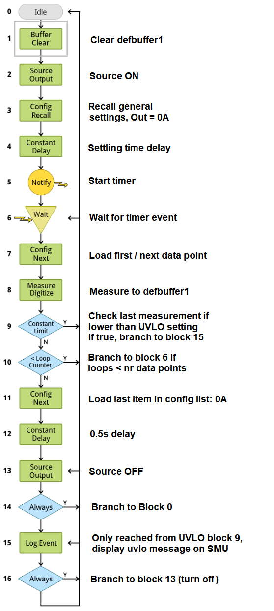

New is block 9 that compares the last voltage measurement to a constant limit (the UVLO value). If the measurement is lower, it branches to block 15. Block 15 can only be reached by block 9 (because block 14 always branches). It displays a UVLO warning log message on the display then block 16 branches to block 13 where the source is immediately turned off.

### Other noteworthy things

The OFF-Mode of the SMU is set to HIGH_Z since the "Normal" setting will not draw a small current, different to zero!

    smu.source.offmode = smu.OFFMODE_HIGHZ

The automatic NPLC function calculates the remaining time for a measurement. The following is a simplified code snippet. Not shown is the handling of the autozero setting.

```python
trigger_latency = 120e-6

# autodelay found is looked up from a table by current settings. 
# alternatively the manual delay is used
source_delay = (autodelay_found + trigger_latency)

max_measure_time = time_step - source_delay  # the maximum time for a measurement
max_measure_time = max_measure_time * 0.95  # safety factor

one_nplc = 1/linefreq  # linefreq is read from SMU

nplc = max_measure_time/one_nplc
if nplc < (one_nplc*0.01):  # the smallest setting is 0.01!
	nplc = 0.01

# nplc must definitely be floored when the parameter is passed with 2 digits precision to the SMU
def floor(a, digits=0):
	return np.true_divide(np.floor(a * 10 ** digits), 10 ** digits)
```

For the beeping you can let the Keithley 2450 play any melody you want. Example:

```python
def _beep_end_ok(self):
	if self.config.beep is True:
		self._inst.write("beeper.beep(0.08, 262)")  # C4
		self._inst.write("beeper.beep(0.08, 523)")  # C5
		self._inst.write("beeper.beep(0.08, 659)")  # E5
```

The GUI is created with the [PAGE GUI creator](http://page.sourceforge.net/).

## License
GNU General Public License v3.0 - See COPYING.txt

